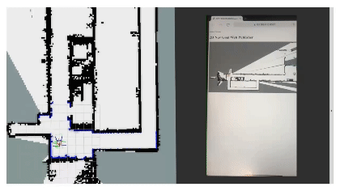
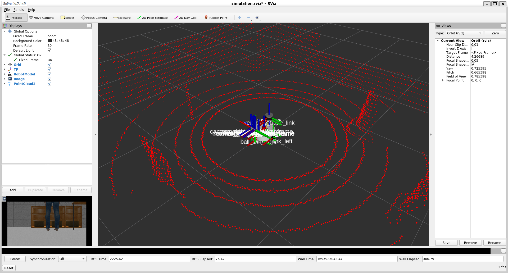
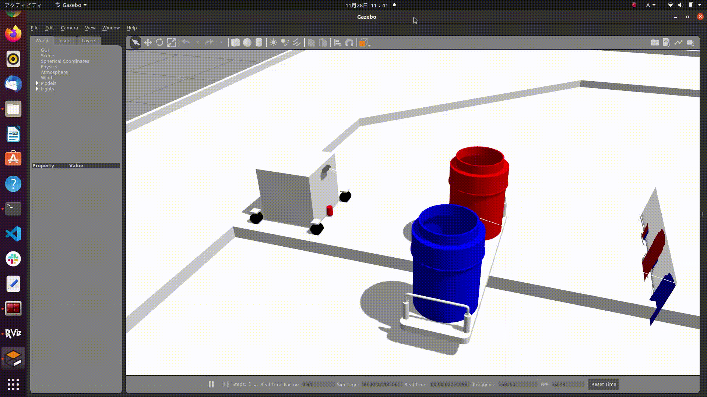

## [navgoal_webgui](https://github.com/islote/navgoal_webgui)

A WebGUI for publishing 2D Nav Goal (geometry_msgs::PoseStamped). 

It also supports touch screens.

 

## [robot_simulator_template](https://github.com/islote/robot_simulator_template)

This repository contains some urdfs of robot components for robot simulation in gazebo, such as 2D/3D LiDAR, RGBD camera and mobile base.

 

## [nhk2021_ilias](https://github.com/KeioRoboticsAssociation/nhk2021_ilias)

Codes and simulator for NHK Robocon 2021. 

I created a urdf model of a 4 wheel steering robot, using the method to rotate joints on Gazebo by ROS Topic. I also created a precise and rotatable field model by converting a 3D CAD field to sdf. 

This repository may provide expertise in simulator construction.

